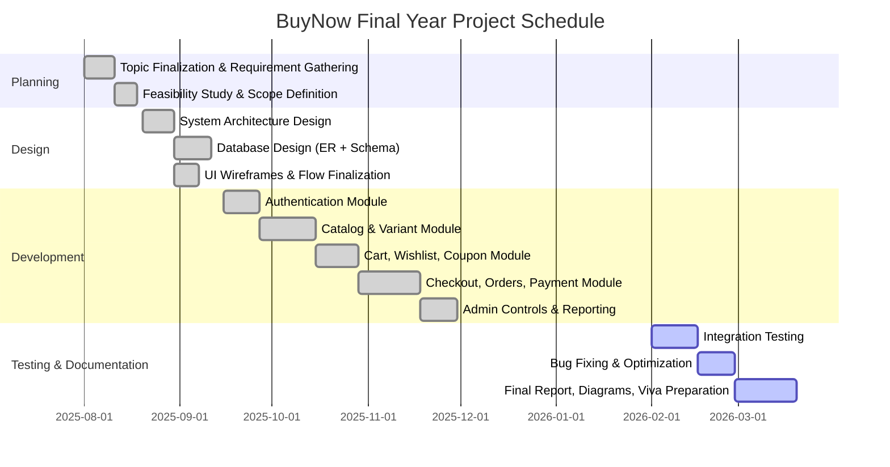

# BuyNow E-Commerce System — Final Year College Project Report

## Abstract
BuyNow is a full-stack e-commerce web application developed using Django, designed to support complete online shopping workflows for customers and administrators. The system provides user registration with OTP verification, product catalog browsing, variant-based inventory, cart and wishlist management, coupon support, order placement, payment integration, invoice generation, and administrative reporting. 

The platform has been structured as a modular, maintainable, and scalable multi-app Django project. Core entities such as users, products, variants, carts, orders, payments, reviews, and reports are represented in normalized database tables with explicit relational mappings. From a software engineering perspective, the project demonstrates the complete SDLC lifecycle: requirement analysis, feasibility study, architecture design, implementation, and report artifacts (DFD, ERD, planning, and technical specifications).

This report presents deep coverage of system objectives, requirement specifications, planning and scheduling (Gantt chart), software structure, implementation strategy, feasibility analysis, and full database table documentation suitable for final-year academic submission.

---

## Introduction
Digital commerce platforms have transformed purchasing behavior by enabling users to discover, compare, and buy products online with convenience and trust. A modern commerce platform must support authentication, product filtering, secure checkout, payment handling, and order tracking while also giving administrators operational control over catalog, pricing, and customer lifecycle.

BuyNow addresses this requirement through a complete web-based shopping ecosystem. It introduces domain-driven modularization where each business domain (catalog, cart, orders, payments, profile, reviews, admin controls) is encapsulated in dedicated Django apps. The platform emphasizes:

- Clean separation of user and admin concerns.
- Variant-level product modeling (color/price/stock).
- Extensible coupon and promotional support.
- Payment records tied to business orders.
- Documentation-ready system design for academic evaluation.

The project is suitable for showcasing applied understanding of database design, web architecture, MVC/MVT patterns, and production-aware software planning.

---

## Objective
### Primary Objective
To design and implement a robust web-based e-commerce management system that supports the end-to-end shopping lifecycle for customers and operation lifecycle for administrators.

### Specific Objectives
1. Implement secure user onboarding with email/OTP verification.
2. Provide structured product catalog management with brands, categories, variants, and images.
3. Build cart and wishlist subsystems with quantity and coupon logic.
4. Implement checkout and order processing with payment integration.
5. Enable customer-facing order history, invoice visibility, and status tracking.
6. Provide administrator control over inventory, users, offers, and analytics.
7. Design a normalized relational database schema with domain consistency.
8. Produce complete software engineering report artifacts for final-year project evaluation.

---

## PROJECT CATEGORY
- **Category:** Web Application / E-Commerce Management System
- **Domain:** Retail Technology / Online Shopping
- **Project Type:** Full-stack CRUD + Transactional System
- **Academic Type:** Final Year Major Project

---

## Tools/Platform
### Programming & Framework
- Python 3.x
- Django (web framework)
- Django templating engine

### Database
- SQLite (default development database)
- Schema can be migrated to PostgreSQL/MySQL for production

### Frontend
- HTML5, CSS3, Bootstrap
- JavaScript (UI interactions + payment flow)

### Third-Party Services/Libraries
- Razorpay (payment workflow)
- Twilio (OTP/SMS workflow)
- Django ORM
- Pillow (image handling)
- Cloudinary (optional media storage support)

### Development Tools
- Git (version control)
- VS Code / similar IDE
- Django manage.py tooling for migrations and checks

---

## Hardware & Software Requirement Specifications

### Hardware Requirements
| Component | Minimum Specification | Recommended |
|---|---|---|
| Processor | Dual-core 2.0 GHz | Quad-core 2.5+ GHz |
| RAM | 4 GB | 8–16 GB |
| Storage | 20 GB free | 50+ GB SSD |
| Internet | Required for package installation & API integration | Stable broadband |

### Software Requirements
| Layer | Requirement |
|---|---|
| Operating System | Windows/Linux/macOS |
| Runtime | Python 3.10+ |
| Framework | Django |
| Database | SQLite (default) / PostgreSQL (production option) |
| Browser | Chrome/Firefox/Edge |
| Tools | Git, pip, virtualenv |

### Deployment-Oriented Requirements
- Environment variables for secret keys and API credentials.
- Configurable media/static hosting.
- SMTP setup for email verification workflow.
- HTTPS recommended for production payment flows.

---

## Functional Requirements & Technical Specifications

### Functional Requirements
1. **User Registration & Authentication**
   - Email-based account creation.
   - OTP verification before activation.
   - Login/logout and blocked-user restrictions.

2. **Catalog Management**
   - Product creation with brand and category mapping.
   - Variant-level management (color, stock, price).
   - Multi-image support for product display.

3. **Cart & Wishlist**
   - Add/remove cart items.
   - Quantity updates and subtotal recalculation.
   - Coupon application with constraints.
   - Wishlist persistence per user.

4. **Checkout & Ordering**
   - Address selection.
   - Payment method selection.
   - Online payment reference storage.
   - Order and order-item creation.

5. **Payments**
   - Payment status tracking (success/pending/failed).
   - Payment method metadata per order.

6. **Feedback & Engagement**
   - Product ratings and textual reviews/feedback.

7. **Admin Features**
   - User management.
   - Category/brand/product management.
   - Variant and coupon control.
   - Report generation support.

### Technical Specifications
| Aspect | Specification |
|---|---|
| Architecture | Django MVT, multi-app modular structure |
| Data Access | Django ORM + relational schema |
| Security Controls | Authentication, role-restricted admin routes, OTP verification |
| Media Handling | Uploaded images for users/products/variants/ads |
| Payment Integration | External gateway callback + local persistence |
| Scalability Path | Move DB to PostgreSQL, cache layer, static/media CDN |

---

## PROJECT PLANNING AND SCHEDULING - Gantt Chart

---

## STRUCTURE OF SOFTWARE

### High-Level Modular Structure (Django Apps)
- `user_home`: authentication, OTP, landing flows.
- `admin_products`: product and image management.
- `admin_variant`: variants, colors, coupons.
- `admin_brand`, `admin_category`: brand/category management.
- `cart`: cart and cart-item logic.
- `wishlist`: wishlist management.
- `user_profile`: shipping address handling.
- `orders`: orders, order-items, payments, methods.
- `user_products`: reviews and feedback.
- `ad_banner`: promotional banners.
- `admin_home`: reporting artifacts.

### Layered Interpretation
1. **Presentation Layer**: Django templates + static assets.
2. **Application Layer**: Views handling request orchestration.
3. **Business Logic Layer**: Domain operations (cart totals, subtotal generation, OTP/payment flow).
4. **Persistence Layer**: Django ORM models and migrations.

### Request Lifecycle
1. User request reaches URL dispatcher.
2. Appropriate app view executes logic.
3. ORM reads/writes related tables.
4. Template renders response or redirects flow.

---

## IMPLEMENTATION

### 1) Authentication & User Lifecycle
- Custom user model with email as primary login identity.
- OTP models for email/mobile validation.
- Account status flags include block/unblock controls.

### 2) Product Domain
- Products are tied to brand and category.
- Variant model supports stock, color, and price differentiation.
- Separate image entities allow scalable product galleries.

### 3) Shopping Lifecycle
- Cart model maintains user-level active shopping session.
- Cart items store variant-specific quantities.
- Coupon metadata applied for discount computations.

### 4) Order & Payment Lifecycle
- Orders are created with address, totals, payment references.
- Order items persist line-item detail with status lifecycle.
- Payment records maintain transaction outcomes.

### 5) Admin Operations
- Admin can manage all master entities and operational records.
- Reporting model stores generated summaries as JSON.

### 6) Frontend Behavior
- Template-driven UI for storefront, checkout, and invoices.
- Razorpay script integration for online payment initiation.

---

## SYSTEM ANALYSIS

System analysis focuses on identifying user pain points in traditional purchasing and translating them into software requirements.

### Existing Problem Context
- Manual shopping lacks remote accessibility.
- Product availability visibility is poor.
- Billing and order tracking are not centralized.
- Customer communication and verification are inconsistent.

### Proposed System Behavior
- Unified online catalog and digital checkout.
- Real-time cart/order workflows.
- Structured account verification and communication.
- Admin dashboard for centralized operational control.

---

## IDENTIFICATION OF NEED

The need for BuyNow arises from practical requirements in both customer and business contexts:

1. **Customers need convenience** — search, compare, and purchase from anywhere.
2. **Businesses need control** — catalog updates, user moderation, and reporting.
3. **Transactions need traceability** — orders, payments, and invoice records.
4. **Systems need trust mechanisms** — OTP verification and status-driven order management.
5. **Academic value** — demonstrates full lifecycle software engineering for real-world use case.

---

## FEASIBILITY STUDY

BuyNow is evaluated across technical, operational, economic, and behavioral dimensions to determine practicality and sustainability.

### Summary
- Technical feasibility: **High**
- Operational feasibility: **High**
- Economic feasibility: **Moderate to High** (low development infra cost)
- Behavioral feasibility: **High** (easy adoption for users/admins)

---

## TECHNICAL FEASIBILITY

The project is technically feasible because:

- Django provides mature architecture for secure web applications.
- ORM-driven schema reduces low-level DB complexity.
- Modular app design supports parallel development and maintainability.
- Third-party APIs (Razorpay/Twilio) are straightforward to integrate.
- Core hosting requirements are lightweight and suitable for student infrastructure.

### Risks & Mitigation
| Risk | Mitigation |
|---|---|
| Payment API downtime | Add retry/fallback and clear status handling |
| OTP delivery delays | Multi-channel fallback (email + SMS), resend logic |
| Media storage growth | Cloud media backend and compression |
| Scaling bottleneck | DB upgrade + caching + query optimization |

---

## OPERATIONAL FEASIBILITY

Operationally, the system aligns with end-user workflows:

- Customers can intuitively browse and buy products.
- Admin workflows map to common retail operations.
- Minimal training required due to web-first UI pattern.
- Supports future organizational process formalization.

### Operational Benefits
- Faster order processing.
- Reduced manual errors in billing/tracking.
- Better inventory visibility.
- Centralized customer and transaction records.

---

## ECONOMICAL FEASIBILITY

From a cost perspective, this project is economically viable:

- Open-source technology stack reduces licensing costs.
- Basic deployment can run on low-cost hosting.
- Maintenance burden is manageable with modular architecture.
- Long-term value from automation outweighs setup cost.

### Cost Components
1. Development resources (student/team effort).
2. Hosting/domain (optional for production showcase).
3. Transactional service charges (payment/communication APIs).
4. Maintenance and incremental enhancements.

---

## BEHAVIOURAL FEASIBILITY

Behavioral feasibility evaluates acceptance and adaptability by users.

- Customers are already familiar with e-commerce interactions.
- Admin users can adopt dashboard tasks quickly.
- OTP-based flows improve confidence and perceived security.
- UI structure supports trust through transparent order/payment status.

### Adoption Strategy
- Short onboarding guide for admin users.
- FAQ/help section for customer payment/order queries.
- Gradual feature rollout in production environments.

---

## ALL DATABASE TABLES

> The following tables are extracted from implemented domain models.

### 1) User & Authentication Tables

#### `CustomUser`
| Field | Type | Description |
|---|---|---|
| id | PK | Primary key |
| identification | UUID | Unique user identifier |
| email | Email(unique) | Login identity |
| username | Char(50) | Display name |
| phone | Char(12, unique, nullable) | Contact number |
| user_image | ImageField | Profile image |
| wallet | Decimal(8,2) | Wallet balance |
| is_blocked | Boolean | Access control flag |

#### `UserOTP`
| Field | Type | Description |
|---|---|---|
| id | PK | Primary key |
| user_id | FK -> CustomUser | OTP owner |
| otp | Integer | One-time password |
| time_st | DateTime(auto_now) | Last issued time |

#### `Mobile_Otp`
| Field | Type | Description |
|---|---|---|
| id | PK | Primary key |
| user_id | FK -> CustomUser | OTP owner |
| otp | Integer | Mobile OTP |
| time_st | DateTime(auto_now) | Last issued time |

### 2) Master Catalog Tables

#### `Brand`
| Field | Type | Description |
|---|---|---|
| id | PK | Primary key |
| brand_id | PositiveInteger(unique) | Business identifier |
| brand_name | Char(50, unique) | Brand name |
| brand_img | ImageField | Brand image/logo |

#### `Categories`
| Field | Type | Description |
|---|---|---|
| id | PK | Primary key |
| category_name | Char(50) | Category title |
| category_image | ImageField | Category image |

#### `Product`
| Field | Type | Description |
|---|---|---|
| id | PK | Primary key |
| identification | Integer | Product reference number |
| product_name | Char(50, unique) | Product name |
| seller_id | FK -> CustomUser(nullable) | Seller owner |
| brand_id | FK -> Brand | Brand mapping |
| category_id | FK -> Categories | Category mapping |
| product_description | Text | Product details |

#### `Product_Image`
| Field | Type | Description |
|---|---|---|
| id | PK | Primary key |
| product_id | FK -> Product | Product mapping |
| image | ImageField | Product image |

#### `Colors`
| Field | Type | Description |
|---|---|---|
| id | PK | Primary key |
| color_name | Char(100) | Variant color label |

#### `Product_Variant`
| Field | Type | Description |
|---|---|---|
| id | PK | Primary key |
| product_id | FK -> Product | Parent product |
| color_id | FK -> Colors | Color option |
| thumbnail | ImageField(nullable) | Variant thumbnail |
| quantity | PositiveInteger | Stock quantity |
| price | PositiveInteger | Variant price |
| is_available | Boolean | Availability flag |

#### `Variant_images`
| Field | Type | Description |
|---|---|---|
| id | PK | Primary key |
| variant_id | FK -> Product_Variant | Variant mapping |
| image | ImageField | Additional variant image |

#### `Advertisement`
| Field | Type | Description |
|---|---|---|
| id | PK | Primary key |
| brand_id | FK -> Brand | Promoted brand |
| ad_image | ImageField | Banner image |

### 3) Cart, Coupon, Wishlist Tables

#### `Coupon`
| Field | Type | Description |
|---|---|---|
| id | PK | Primary key |
| name | Char(15) | Coupon code/name |
| min_amount | PositiveBigInteger | Minimum order amount |
| off_percent | PositiveInteger | Discount percentage |
| max_discount | PositiveBigInteger | Maximum discount cap |
| quantity | PositiveInteger | Coupon usage quantity |
| expiry_date | Date | Validity end date |
| status | Boolean | Active/inactive flag |

#### `Cart`
| Field | Type | Description |
|---|---|---|
| id | PK | Primary key |
| cart_id | Integer(unique) | Business cart ID |
| user_id | FK -> CustomUser | Cart owner |
| date_created | DateTime(auto_now_add) | Creation timestamp |
| status | Boolean | Active/inactive cart |
| coupon_id | FK -> Coupon(nullable) | Applied coupon |
| coupon_discount | BigInteger(nullable) | Discount value |

#### `CartItem`
| Field | Type | Description |
|---|---|---|
| id | PK | Primary key |
| cart_id | FK -> Cart | Parent cart |
| variant_id | FK -> Product_Variant | Selected variant |
| qty | PositiveInteger | Quantity |

#### `Wishlist`
| Field | Type | Description |
|---|---|---|
| id | PK | Primary key |
| user_id | FK -> CustomUser(nullable) | Wishlist owner |
| variant_id | FK -> Product_Variant(nullable) | Saved variant |
| date_added | DateTime(auto_now_add) | Save timestamp |

### 4) Order & Payment Tables

#### `Payment_methods`
| Field | Type | Description |
|---|---|---|
| id | PK | Primary key |
| method | Char(100) | Method label (COD/Online/etc.) |

#### `Order`
| Field | Type | Description |
|---|---|---|
| id | PK | Primary key |
| order_id | Char(20, unique) | Business order reference |
| customer_id | FK -> CustomUser(nullable) | Buyer |
| address_id | FK -> User_Address(nullable) | Shipping address |
| placed_at | DateTime(auto_now_add) | Order time |
| gst | Integer(nullable) | GST amount/value |
| total | Decimal(8,2) | Final total |
| coupon | Char(15, nullable) | Applied coupon name |
| coupon_discount | BigInteger(nullable) | Coupon discount value |
| payment_method_id | FK -> Payment_methods(nullable) | Chosen method |
| payment_id | Char(100, nullable) | Gateway payment ID |
| payment_order_id | Char(100, nullable) | Gateway order ID |
| payment_signature | Char(100, nullable) | Gateway signature |
| status | Char(choices) | pending/completed/cancelled |

#### `Order_item`
| Field | Type | Description |
|---|---|---|
| id | PK | Primary key |
| user_id | FK -> CustomUser(nullable) | Associated user |
| order_id | FK -> Order | Parent order |
| variant_id | FK -> Product_Variant(nullable) | Ordered variant |
| quantity | PositiveInteger | Item quantity |
| subtotal | Decimal(10,2) | Line subtotal |
| status | Char(choices) | Item lifecycle state |

#### `Payment`
| Field | Type | Description |
|---|---|---|
| id | PK | Primary key |
| order_id | FK -> Order | Parent order |
| buyer_id | FK -> CustomUser | Paying user |
| payment_date | DateTime(auto_now_add) | Payment timestamp |
| amount | Decimal(10,2) | Paid amount |
| payment_status | Char(choices) | success/failed/pending |
| payment_method | Char(50) | Payment medium |

### 5) Review & Reporting Tables

#### `ReviewRating`
| Field | Type | Description |
|---|---|---|
| id | PK | Primary key |
| user_id | FK -> CustomUser | Reviewer |
| product_id | FK -> Product | Reviewed product |
| review | Text(nullable) | Review content |
| rating | Float | Score |
| status | Boolean | Visibility/status |
| updated_at | Date(auto_now) | Last update date |

#### `Feedback`
| Field | Type | Description |
|---|---|---|
| id | PK | Primary key |
| product_id | FK -> Product | Related product |
| buyer_id | FK -> CustomUser | Feedback author |
| rating | PositiveSmallInteger | Rating score |
| comment | Text(blank) | Feedback text |
| created_at | DateTime(auto_now_add) | Created timestamp |

#### `AdminReport`
| Field | Type | Description |
|---|---|---|
| id | PK | Primary key |
| report_type | Char(100) | Report category |
| generated_at | DateTime(auto_now_add) | Generation time |
| report_data | JSONField | Serialized report payload |

---

## Conclusion
BuyNow demonstrates a complete and practical implementation of an e-commerce platform aligned with final-year project expectations. The project covers the full lifecycle from requirement engineering to structured implementation and technical documentation. It is modular, extensible, and academically strong due to its clear architecture, relational schema design, and support for modern commerce workflows such as OTP verification, variant-based inventory, and payment-linked order records.

This document can be directly used as a project report backbone and further customized with screenshots, sample outputs, and institution-specific formatting.
