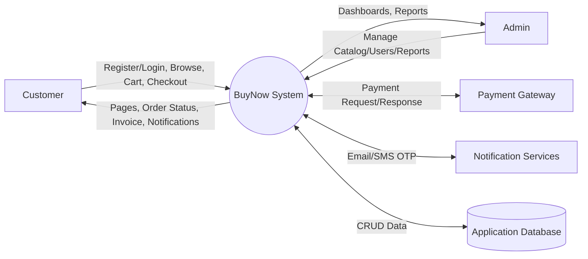
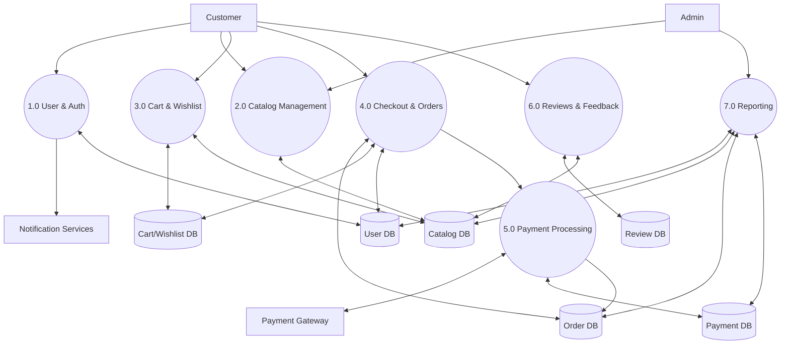
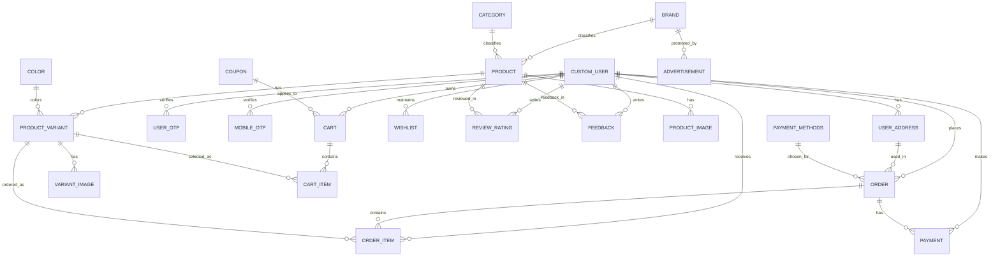
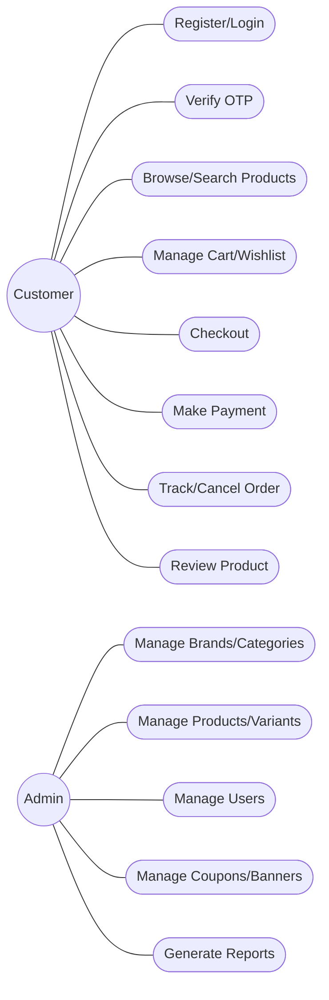
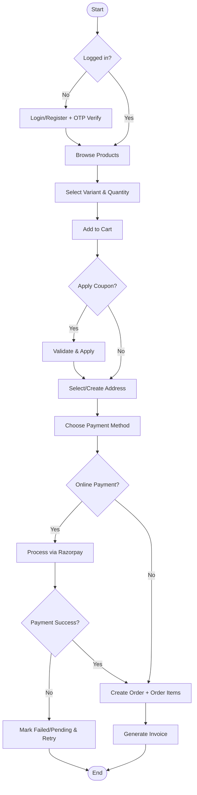
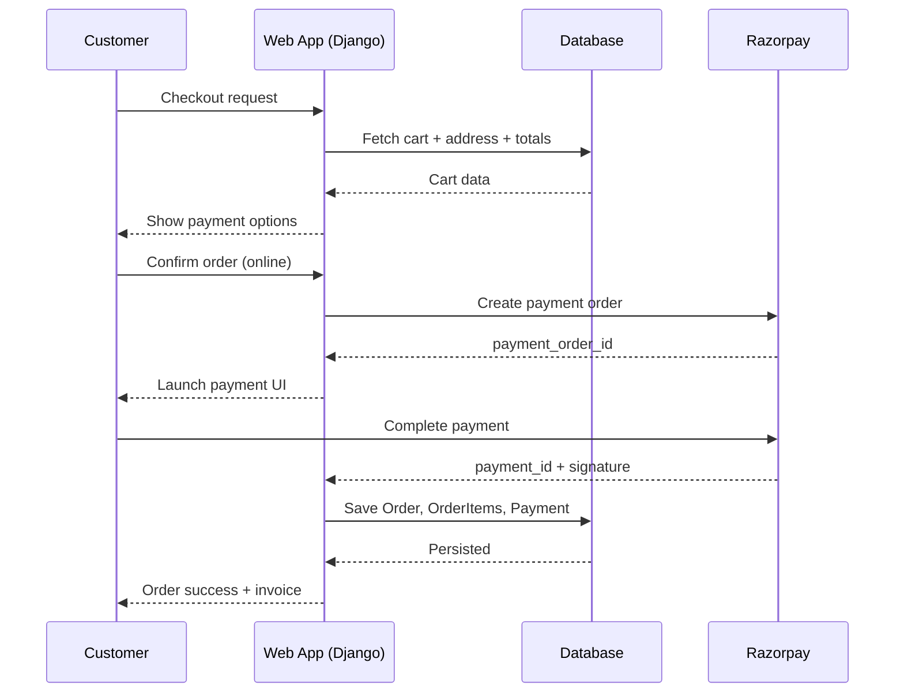
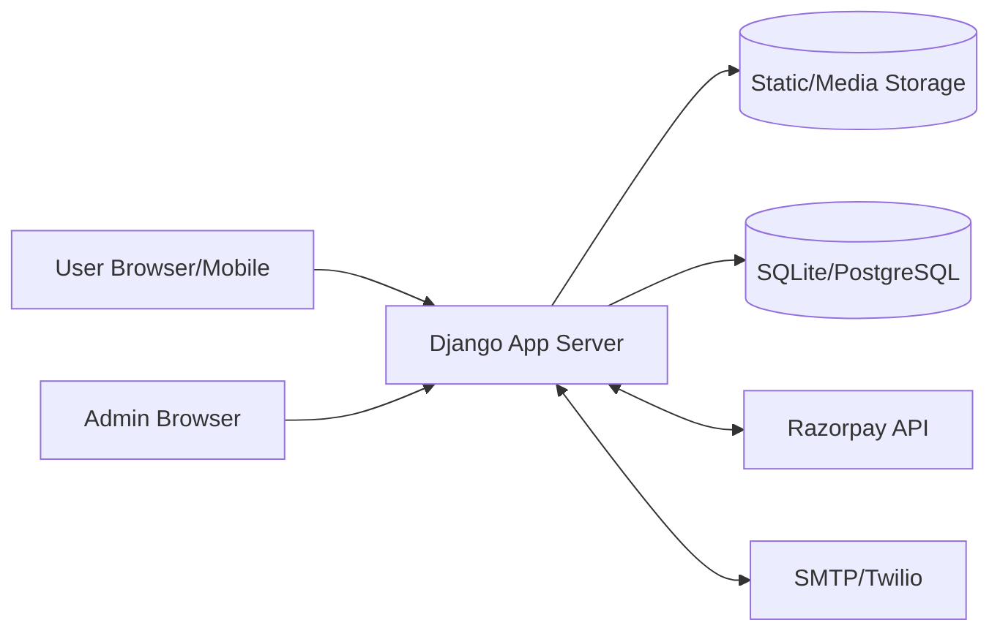

# BuyNow Project Report Artifacts

This document provides ready-to-use **DFDs**, **ERD**, and supporting report tables/diagrams for the BuyNow Django e-commerce system.

---

## 1) Project Summary Table

| Item | Details |
|---|---|
| Project Name | BuyNow |
| Project Type | Web-based E-commerce Platform |
| Tech Stack | Django, SQLite/PostgreSQL-ready models, HTML/CSS/Bootstrap, Razorpay integration |
| Main Users | Customer, Admin, Seller (via product ownership), Payment Gateway |
| Core Domains | Authentication, Catalog, Cart, Checkout, Orders, Payments, Wishlist, Reviews, Coupons |

---

## 2) Actor & Responsibility Table

| Actor | Responsibilities |
|---|---|
| Customer | Register/login, browse products, add to cart/wishlist, checkout, place/cancel orders, view invoice |
| Admin | Manage brands/categories/products/variants, monitor users, manage offers/coupons, track reports |
| Seller (logical role) | Adds/manages owned products and variants |
| Payment Gateway (Razorpay) | Creates/authorizes payment transactions and returns payment metadata |
| Notification Services | Sends OTP/email/SMS alerts |

---

## 3) Functional Requirements Table

| ID | Requirement |
|---|---|
| FR-01 | User registration and OTP-based verification |
| FR-02 | Secure login/logout and blocked-user handling |
| FR-03 | Product catalog with brand/category/variant support |
| FR-04 | Cart operations with quantity and coupon discount |
| FR-05 | Checkout with address selection and payment method |
| FR-06 | Order creation with item-level status tracking |
| FR-07 | Payment recording and status tracking |
| FR-08 | Wishlist and product review/feedback |
| FR-09 | Admin management for inventory and users |
| FR-10 | Invoice generation and order history |

---

## 4) Non-Functional Requirements Table

| ID | Requirement | Target |
|---|---|---|
| NFR-01 | Usability | Simple storefront + admin UI |
| NFR-02 | Reliability | Order/payment records persisted transactionally |
| NFR-03 | Security | Authenticated routes, OTP verification, role-based admin controls |
| NFR-04 | Performance | Product browsing and cart operations should be responsive for standard workloads |
| NFR-05 | Maintainability | Modular Django apps by domain |

---

## 5) Data Flow Diagram (DFD) — Level 0 (Context)

---

## 6) Data Flow Diagram (DFD) — Level 1

---

## 7) Entity Relationship Diagram (ERD)

---

## 8) Use Case Diagram

---

## 9) Activity Diagram — Order Placement

---

## 10) Sequence Diagram — Checkout & Payment

---

## 11) Deployment Diagram (Logical)

---

## 12) Data Dictionary (Core Tables)

### 12.1 User/Auth Domain

| Table | Key Fields |
|---|---|
| `CustomUser` | `id`, `email`, `username`, `phone`, `wallet`, `is_blocked`, `identification` |
| `UserOTP` | `id`, `user_id`, `otp`, `time_st` |
| `Mobile_Otp` | `id`, `user_id`, `otp`, `time_st` |
| `User_Address` | `id`, `user_id`, `fullname`, `contact_number`, `house_name`, `city`, `state`, `pincode` |

### 12.2 Catalog Domain

| Table | Key Fields |
|---|---|
| `Brand` | `id`, `brand_id`, `brand_name`, `brand_img` |
| `Categories` | `id`, `category_name`, `category_image` |
| `Product` | `id`, `identification`, `product_name`, `seller_id`, `brand_id`, `category_id` |
| `Product_Image` | `id`, `product_id`, `image` |
| `Colors` | `id`, `color_name` |
| `Product_Variant` | `id`, `product_id`, `color_id`, `quantity`, `price`, `is_available`, `thumbnail` |
| `Variant_images` | `id`, `variant_id`, `image` |
| `Advertisement` | `id`, `brand_id`, `ad_image` |

### 12.3 Cart/Order/Payment Domain

| Table | Key Fields |
|---|---|
| `Coupon` | `id`, `name`, `min_amount`, `off_percent`, `max_discount`, `quantity`, `expiry_date`, `status` |
| `Cart` | `id`, `cart_id`, `user_id`, `coupon_id`, `coupon_discount`, `status` |
| `CartItem` | `id`, `cart_id`, `variant_id`, `qty` |
| `Payment_methods` | `id`, `method` |
| `Order` | `id`, `order_id`, `customer_id`, `address_id`, `total`, `coupon`, `payment_method_id`, `status` |
| `Order_item` | `id`, `order_id`, `variant_id`, `user_id`, `quantity`, `subtotal`, `status` |
| `Payment` | `id`, `order_id`, `buyer_id`, `amount`, `payment_status`, `payment_method`, `payment_date` |

### 12.4 Engagement/Reporting Domain

| Table | Key Fields |
|---|---|
| `Wishlist` | `id`, `user_id`, `variant_id`, `date_added` |
| `ReviewRating` | `id`, `user_id`, `product_id`, `review`, `rating`, `status` |
| `Feedback` | `id`, `buyer_id`, `product_id`, `rating`, `comment`, `created_at` |
| `AdminReport` | `id`, `report_type`, `generated_at`, `report_data` |

---

## 13) Report-Ready Notes

- These Mermaid blocks can be pasted directly into Markdown renderers that support Mermaid (GitHub, many documentation tools).
- If your college/report template requires images, render these diagrams to PNG/SVG and insert them under corresponding chapters (System Design, Database Design, Process Design).
- Suggested chapter mapping:
  1. System Overview → Sections 1–4
  2. DFDs → Sections 5–6
  3. Database Design → Sections 7 and 12
  4. Behavioral Design → Sections 8–10
  5. Deployment/Implementation View → Section 11
